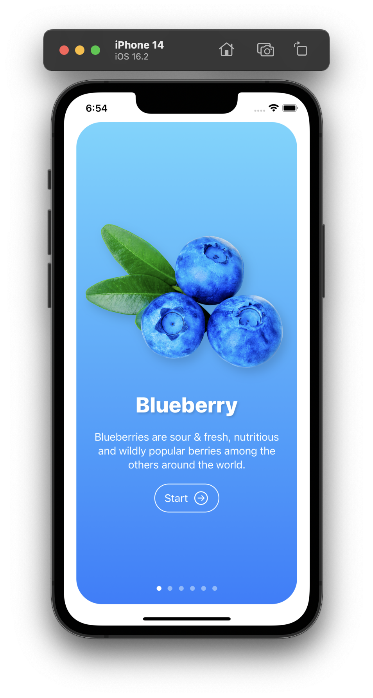
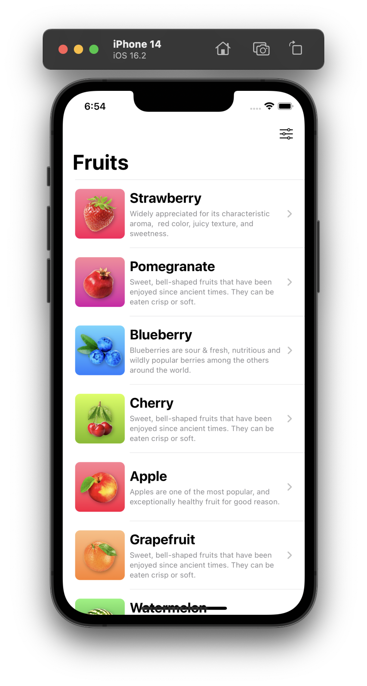
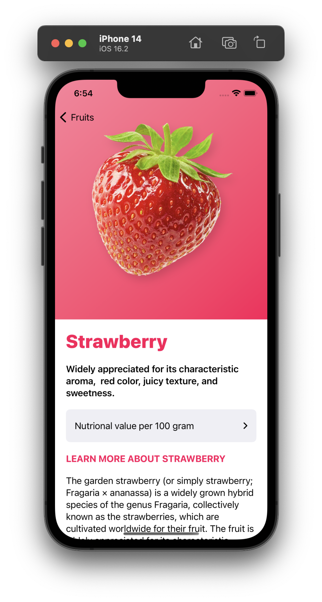
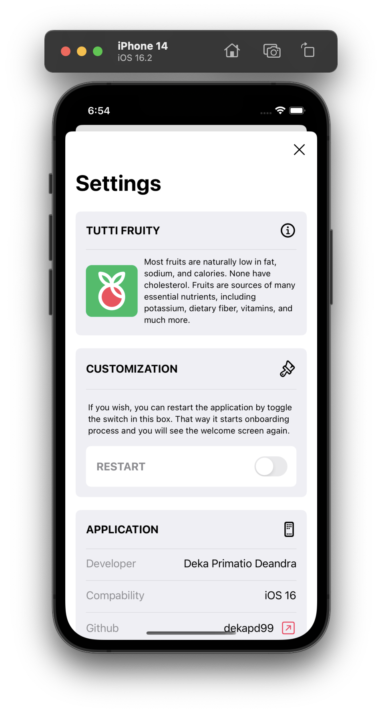

<!-- ABOUT THE PROJECT -->
<h1 align="center">
  <br>
    <a href="#" target="_blank"></a>
  <br>
  <p>Tutti Fruity</p>
</h1>

Tutti Fruity adalah Aplikasi iOS pengenalan nutrisi buah-buahan yang datanya diambil dari API [fruitvice.com](https://fruityvice.com/#1) (localized data).

### Preview
<p align="center">
  <a href="#" target="_blank"></a>
  <a href="#" target="_blank"></a>
  <a href="#" target="_blank"></a>
  <a href="#" target="_blank"></a>
</p>

<!-- ABOUT THE FILE & FOLDER STRUCTURE -->
## Folder & File Structure
Berikut struktur file dan folder pada Tutti Fruity:

    .
    ├── Assets                              # Aset Warna, Logo & Gambar
    ├── Data                    
    │   └── FruitData.swift                 # Berisikan Static Local Data Variable
    │
    ├── Model                   
    │   └── FruitModel.swift                # Berisikan Fruit Local Data Type Declaration
    │
    ├── Component                   
    │   ├── FruitCardComponent.swift        # Berisikan Komponen Fruit Onboarding Card (OnBoardingView)
    │   ├── StartButtonComponent.swift      # Berisikan Komponen Start Button (OnBoardingView)
    │   ├── FruitRowComponent.swift         # Berisikan Komponen Fruit Row (ContentView)
    │   ├── FruitHeaderComponent.swift      # Berisikan Komponen Fruit Header (FruitDetailView)
    │   ├── SourceLinkComponent.swift       # Berisikan Komponen Source Link (FruitDetailView)
    │   ├── FruitNutrientsComponent.swift   # Berisikan Komponen Fruit Nutrient Value (FruitDetailView)
    │   ├── SettingLabelComponent.swift     # Berisikan Komponen Settings Label (SettingsView)
    │   └── SettingRowComponent.swift       # Berisikan Komponen Settings Row (SettingsView)
    │
    └── View                     
        ├── OnBoardingView.swift            # Tampilan OnBoarding Page
        ├── Tutti_Fruity.swift              # Root Project: Konfigurasi ContentView
        ├── ContentView.swift               # Tampilan Home Page
        ├── FruitDetailView.swift           # Tampilan Detail Page for Each Fruit
        └── SettingsView.swift              # Tampilan Halaman Setting

<!-- List of Features -->
## Features:

* Reusable Components
* All Stacks (HStack, VStack, ZStack)
* ScrollView (Vertical)
* GroupBox
* ListView
* OnBoarding Screen
* Basic Storage Session with @AppStorage
* Declarative UI with @State
* URL Link
* Restard Session with Toggle
* Importation Assets from Internet for Image Assets & Color Assets
* Localized API Fruit Data

<!-- Used Tools -->
## Build With:

* [Swift](https://www.swift.org/documentation/)
* [SwiftUI](https://developer.apple.com/documentation/swiftui/)
* [Xcode](https://developer.apple.com/xcode/)
* [Fruit Data](https://fruityvice.com/#1)

<!-- How to Install -->
## Installation
Untuk menggunakan repositori ini, ikutilah petunjuk penggunaan berikut dan pastikan git sudah terinstall pada komputer (semua perintah dilaksanakan pada `cmd.exe` atau `terminal`):

1. Lakukan download .zip atau `clone` repositori dengan cara:
```bash
git clone https://github.com/dekapd99/Tutti-Fruity.git
```

2. Jika sudah Download / Clone Project, silahkan buka Project di Xcode dengan Klik Open a Project or File.
3. Pastikan untuk memilih iPhone 14 pada Target Simulator (Kolom Device dibagian atas XCode). 
4. Build & Run

<!-- What Kind of License? -->
## License
MIT License: Copyright (c) 2022 
Deka

DISCLAIMER: ASSETS ARE USED FOR EDUCATION PURPOSE ONLY, NOT FOR COMMERCIAL PURPOSES

Assets Source: [Image](google.com) & [SF SYMBOLS 4 ICON](https://developer.apple.com/sf-symbols/)

<p align="right">(<a href="#top">back to top</a>)</p>
